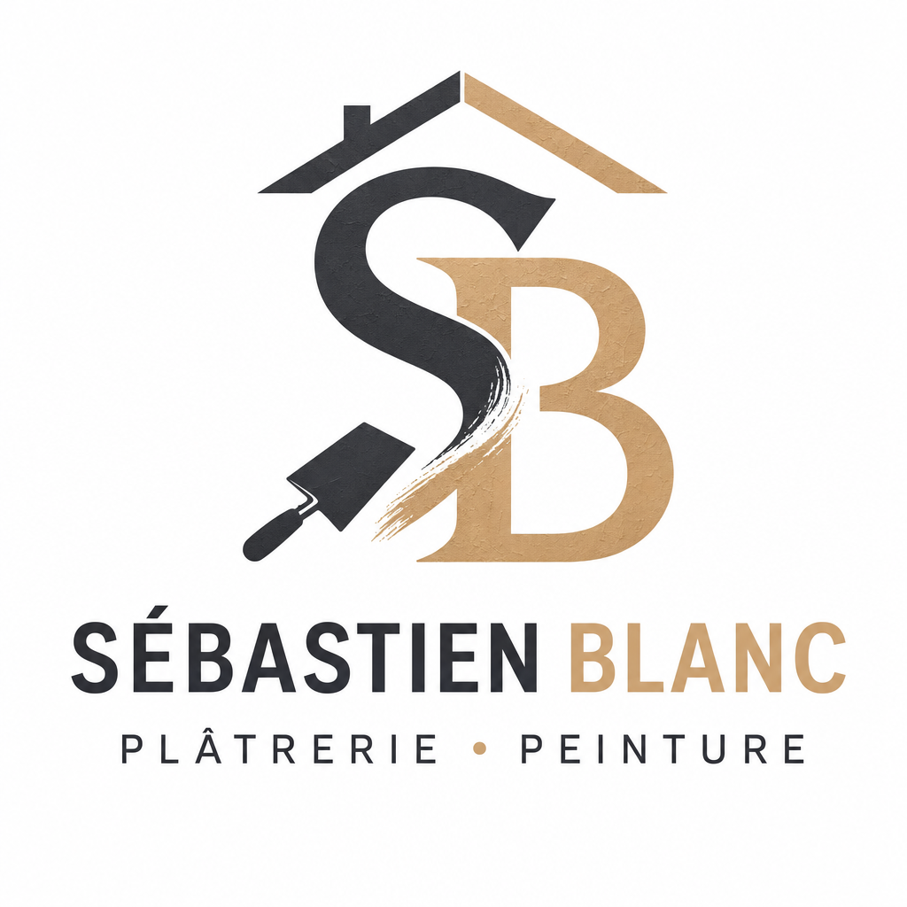

# Qualité des logos OpenAI dans le studio — causes, corrections, validation

Branche : `claude/ecom-studio-ia-platform-8cwl79` (non fusionnée). Aucun appel payant n'a été fait pour ce travail.

## 1. Référence et comparaison

### A. Le logo réussi (appel direct)



| | |
|---|---|
| Modèle | `gpt-image-2` |
| Paramètres | 1024×1024, qualité haute, PNG, fond opaque, flux avec 2 aperçus |
| Coût | 0,19 € |
| Demande | environ 900 caractères |

Ce que disait la demande, et qui explique la réussite :
1. **Un concept précis et visuel** : « a crafted monogram of the initials S and B, drawn with care and personality, combined with an element of the trade (a roofline, a trowel stroke or a brush stroke), with a subtle material texture ».
2. **Deux couleurs choisies pour le métier**, avec leurs codes : anthracite `#2E2E33` et sable chaud `#C8A27A`.
3. **Un traitement typographique décrit** : nom en capitales grasses, le mot BLANC dans la couleur sable, ligne d'activités plus petite et espacée.
4. **Une exigence de finition explicite** : « a real agency-quality logo… drawn with care and personality ».
5. **Aucune consigne qui affaiblit** : pas de « nothing is imposed », pas de « avoid only clumsy clichés ».

### B. Les 3 logos médiocres du studio

« Le passage de lisseuse » 5,5/10, « La cornière » 5,8/10, « Le sceau taloché » 6,2/10. Environ 0,18 € chacun, `gpt-image-2`.

Ces images et leurs fiches sont dans votre Codespace, pas ici. Pour les exporter avec la demande exacte qui a été envoyée (recalculée par l'ancien code), lancez dans le Codespace :

```bash
git pull
npx tsx scripts/logo-series-export.ts "Sebastien Blanc" --legacy
```

Le dossier `reports/logo-quality/serie-…/` contiendra les 3 originaux, `prompts.md` (demandes exactes, notes, défauts relevés) et `serie.json`. Un `git add reports/logo-quality && git commit && git push` me les rend lisibles. **[À compléter : images et demandes réelles de la série médiocre, après export.]**

## 2. Causes précises (lues dans le code qui a produit la série B)

1. **Les directions partaient d'un objet du métier, pas d'une idée graphique.**
   - La consigne des territoires demandait une idée « tirée de la logique du métier (geste, outil, matière, résultat) ».
   - Le modèle de texte a donc nommé des objets : la lisseuse, la cornière, la taloche.
   - Le modèle d'images les a dessinés littéralement :
     - le passage de lisseuse est devenu un effet horizontal maladroit ;
     - la cornière, un monogramme enfermé dans un carré (une cornière est un angle) ;
     - le sceau taloché, un cachet rond avec des traits.
2. **La demande envoyée à OpenAI était une liste d'options, pas un brief.** Elle juxtaposait des catégories abstraites : « Composition: symbol above the name. Typography: grotesque sans-serif, bold weight, capitals, normal letter-spacing ». Rien ne disait comment dessiner la marque, quel traitement donner au nom, ni quel niveau de finition atteindre.
3. **Des consignes qui affaiblissaient l'exigence.**
   - « Nothing is imposed… follow this direction only » et « Avoid only clumsy stock-icon clichés » autorisaient de fait les solutions banales.
   - Aucune exigence de finition n'était écrite, contrairement à l'essai direct.
4. **Couleurs génériques.**
   - La demande imposait la palette du projet, créée automatiquement avant le logo.
   - Pour Sébastien Blanc dans la base de démonstration : bleu ardoise `#446274` et violet `#747FB4`. Sans rapport avec le métier ni avec la référence (anthracite et sable).
   - **[À vérifier : palette réelle du projet dans votre Codespace]**, visible dans `serie.json` après l'export.
5. **Rien n'était dit sur la marque.** Ni le positionnement, ni la clientèle, ni la personnalité n'étaient transmis au modèle d'images.
6. **Le contrôle notait bien, mais ne savait pas nommer un concept pauvre.**
   - Les notes de 5,5 à 6,2 étaient justes : rien n'a été relevé artificiellement.
   - Mais le contrôle n'avait aucun critère pour un concept interchangeable (cachet, cadre, police standard).
   - Il ne disait pas non plus quoi corriger, et « Nouvelle version » ne réutilisait pas sa critique.

Ce qui n'était **pas** en cause :
- le modèle (`gpt-image-2`, le même que la référence) ;
- les paramètres (haute qualité, 1024², flux) ;
- les transformations : l'original est conservé, et le fond retiré ne touche pas au dessin ;
- la connexion.

## 3. Corrections intégrées (moteur existant, aucun nouveau moteur)

| Fichier | Correction |
|---|---|
| `src/lib/logo-v2/ai.ts` (directions) | Voir le détail ci-dessous. |
| `src/lib/logo-v2/territories.ts`, `types.ts` | Champs `imageBrief` (1 600 caractères au plus) et `colors` (HEX valides seulement) gardés avec chaque direction. |
| `src/lib/logo-v2/artwork.ts` (demande à OpenAI) | Voir le détail ci-dessous. |
| `src/lib/logo-v2/artwork.ts` (contrôle) | Voir le détail ci-dessous. |
| `src/lib/quality/policies.ts` | `generic_concept` bloquant. Version `2026-10-p11d`. **Seuil inchangé : 8/10.** |
| `src/lib/logo-v2/engine.ts` | La correction proposée est enregistrée avec la proposition. « Nouvelle version » transmet au dessin les remarques du client, plus la critique du contrôle (défauts et correction). |
| Onglet Marque (`logo-v2-panel.tsx`, route) | Chaque création écartée affiche « À corriger dans une nouvelle version : … ». La note, les défauts, la provenance, le coût et l'original étaient déjà affichés. |

**Directions (`src/lib/logo-v2/ai.ts`)** — chaque direction écrit désormais :
- un **brief de direction artistique** (`imageBrief`, en anglais, 90 à 160 mots), qui donne :
  - l'idée centrale : une idée graphique, pas un objet nommé ;
  - ce que montre la marque et comment elle est dessinée ;
  - la composition ;
  - le traitement typographique du nom ;
  - les couleurs en HEX ;
  - la finition ;
  - ce qu'il faut éviter.
- ses **couleurs** (`colors`), choisies pour la marque, quand la palette n'est pas validée par le client. Une palette validée n'est jamais remplacée.

Les directions reçoivent aussi le positionnement, la clientèle et la personnalité. Les concepts pauvres y sont interdits, avec la précision que la simplicité reste bienvenue quand elle porte une vraie idée.

**Demande à OpenAI (`src/lib/logo-v2/artwork.ts`)** — elle est construite comme celle de la référence :
- marque, activités, positionnement, clientèle, personnalité ;
- direction ;
- **brief de direction artistique** ;
- style ;
- couleurs ;
- texte exact ;
- **barre de qualité** (`QUALITY_BAR`) ;
- **concepts pauvres à éviter** (`POOR_CONCEPTS`) ;
- sortie.

Quand un brief existe, les lignes génériques (composition, typographie, « nothing is imposed ») ne sont plus répétées, car elles le contredisaient. La demande reste sous 3,8 Ko : le brief est raccourci si besoin, le texte exact et les règles jamais.

**Contrôle (`src/lib/logo-v2/artwork.ts`)** :
- deux critères ajoutés : **couleur** et **différenciation**, avec des définitions précisées (positionnement, traitement typographique, finition) ;
- **`genericConcept`** : concept pauvre (cercle, carré arrondi, cachet sans personnalité, initiales encadrées, police standard, symbole interchangeable, décor sans intention), en précisant qu'une forme simple portée par une vraie idée n'en est pas un ;
- **`fix`** : la correction précise à apporter (symbole, typographie, composition, couleur ou concept).

Toujours en place :
- une forme de remplissage géométrique est écartée sans relecture payée ;
- une copie n'est jamais présentée comme une création distincte ;
- le PNG original reste le livrable, et un SVG n'est proposé que s'il est fidèle ;
- l'identité est construite à partir du logo choisi ;
- les plafonds de 40 % et 50 % HT, la réservation, l'accord avant dépense et l'absence de relance après facturation incertaine sont inchangés.

## 4. Demandes avant / après

- **Avant** : voir la section 2 et l'export `--legacy` (demandes exactes de la série B).
- **Après** : `reports/logo-quality/prompts-apres.md`. Ce sont les 3 demandes exactes que le moteur enverrait pour les directions A, B et C, générées par le code du studio sans rien envoyer (environ 3 Ko chacune).

Extrait, direction A (Signature premium) :

```
Art direction: A refined monogram of the letters S and B, custom-drawn as one mark: the S flows into the bowl of the B with a single continuous, perfectly smoothed curve, like a flawless finish on a wall. Precise contrast between thick and thin strokes, sharp terminals, generous negative space, no frame around the letters. Below, the name SÉBASTIEN BLANC in a contemporary serif, spaced capitals, then the line PLÂTRERIE • PEINTURE much smaller and widely spaced. Deep charcoal #2E2E33 …
Quality bar: a real agency-quality logo, drawn with care and personality, every element deliberate; …
Avoid poor concepts: a plain circle, triangle or rounded square used as the symbol with no graphic idea; a generic stamp or seal with no personality; letters simply placed inside a square or circle frame; …
```

Les 3 directions du benchmark sont propres à ce projet. Elles sont dans `scripts/benchmark-logo-quality.ts`, jamais dans le moteur : pour les autres entreprises, c'est le modèle de texte qui écrit les directions et leurs briefs, selon leur secteur et leur positionnement. Un test vérifie qu'aucun mot de métier d'un client n'apparaît dans le code des générateurs.

## 5. Tests réels dans le studio (10/10/2026)

Studio réel lancé dans Claude Cloud : site (`next start`), worker, base de démonstration séparée, OpenAI par la clé
du relais réseau (jamais écrite). Compte client de démonstration, forfait « Vendre », budget 26,63 €.

| Essai | Ce qui s'est passé | Appels OpenAI | Dépense tracée |
|---|---|---|---|
| 1 | Directions routées vers Anthropic (aucune clé) : échec masqué (« comptage impossible »), puis **repli silencieux** sur 3 logos construits. | 0 | 0 € |
| Contrôle gratuit | Comptage exact de la demande des directions chez OpenAI (`gpt-5.6-sol`) : 2 266 jetons, coût maximal 0,26 €. Envoi bloqué volontairement ; réservation réconciliée à 0 €. | 0 envoi | 0 € |
| 2 (accord : plafond 1,58 €) | Directions par `gpt-5.6-sol` : **502 « upstream request failed »** du relais au bout d'environ 30 s, **3 fois** (relances automatiques de l'ancien code), 96 s au total. Série arrêtée avant toute image, avec la raison affichée. | 3 envois, sans réponse | 0 € tracé — **réel non vérifiable** |

Preuves : `logo-quality/studio-reel/essai-1-repli-local/` et `essai-2-502/` (captures de l'onglet Marque, `preuves.json` :
appels, réservations, erreurs ; aucune clé).

**Consommation réelle de l'essai 2 : non vérifiée.** La clé du relais n'a pas le droit `api.usage.read` (lecture de la
consommation refusée par OpenAI). Si OpenAI a traité les 3 demandes, le maximum possible est 3 × 0,26 € ≈ **0,77 €**.
À vérifier dans le tableau de bord OpenAI (Usage, 10/10/2026 vers 15 h 36–15 h 38 UTC, modèle `gpt-5.6-sol`).

**Aucun logo OpenAI n'a encore été produit dans le studio** : la qualité des nouvelles demandes, les 3 cartes, les
boutons, le rechargement, les coûts par image et l'identité complète **restent à démontrer** par une série réussie.

### Défauts prouvés par ces essais, et corrigés

| Défaut | Correction | Test |
|---|---|---|
| Aucun modèle de texte « fort » d'OpenAI au catalogue : directions envoyées à Anthropic sans clé | GPT-5.6 Sol ajouté (verrouillé jusqu'à confirmation et tarif dans l'administration) | `logo-openai-routage` |
| Vraie raison masquée par « Comptage des jetons impossible » | La raison réelle remonte (fournisseur absent, code HTTP et message, sans secret) | `logo-openai-routage` |
| Repli silencieux sur des logos construits après un devis de logos OpenAI accepté | La série s'arrête, la raison s'affiche, aucune image n'est demandée | `openai-streaming` |
| Devis calculé sur la route manuelle, pas sur le modèle réellement choisi | Devis sur le modèle du routage automatique (1,58 € au lieu de 1,29 €) | `logo-openai-routage` |
| Texte OpenAI : 502 relancé 2 fois et compté « non facturé » | Un 5xx est **incertain** : un seul envoi, coût maximal retenu, arrêt, aucune relance (même règle que les images) ; seul un 429 est relancé | `routage-multifournisseur` |
| Texte OpenAI sans flux : relais coupé vers 30 s pendant la réflexion | Réponse **en flux** (SSE), comme les images qui passent déjà par le relais ; flux coupé sans réponse finale = incertain | `routage-multifournisseur` |
| Onglet Marque : « Brief et directions » coché en vert alors que c'est l'étape en échec ; note « image refusée non facturée » hors sujet | Étape en échec marquée ✕, étapes suivantes non commencées ; note adaptée (aucune image demandée / résultat incertain) | capture `essai-2-502/affichage-apres-correction.png` |

**Non vérifié** : que le flux de texte passe le relais sans coupure. Seul un vrai appel le prouvera (les images en
flux, elles, passent : essai réel précédent).

Vérifications : `npx tsc --noEmit` sans erreur ; `npx vitest run` 129 fichiers, 1 117 tests réussis ; `next build` réussi.

## 6. Ce qui reste à démontrer (honnêtement)

- **La qualité visuelle réelle des nouvelles demandes** : seules de vraies générations la montreront. Je ne garantis pas 3 logos parfaits, seulement des demandes et des contrôles du niveau de la référence.
- **Le modèle de texte qui écrit les directions** doit suivre la nouvelle consigne (briefs concrets). Le benchmark contourne cette étape avec les 3 directions A/B/C ; il faudra vérifier sur un autre projet que les briefs écrits par l'IA sont du même niveau.
- **La série médiocre exacte** (images, demandes, défauts) reste à exporter depuis le Codespace (section 1).
- **Correction du nom en une seule couleur** : si le client change de nom après son choix, un nom en deux tons (« BLANC » en sable) est réécrit dans une seule couleur.

## 7. Dernier test réel : budget et procédure

| | |
|---|---|
| Ce qui est lancé | 3 logos, directions A, B et C, par le moteur du studio : vraies images `gpt-image-2` en flux et vraies relectures sur image |
| Devis maximal (plafond, calculé par le studio, tarif `gpt-image-2` saisi à 0,22 $) | **1,29 €** (0,26 € maximum par image, plus les relectures et l'étape directions) |
| Coût réel attendu | environ 3 × 0,19 € d'images, plus quelques centimes de relecture, soit **≈ 0,60 à 0,70 €** |
| Relance automatique | aucune ; plafond = devis |

Dans le Codespace, après `git pull` et `npm install` :

```bash
npx tsx scripts/benchmark-logo-quality.ts "Sebastien Blanc"            # affiche le devis, n'envoie rien
npx tsx scripts/benchmark-logo-quality.ts "Sebastien Blanc" --confirm  # lance la série, une seule fois, après votre accord
```

Les 3 logos apparaissent ensuite dans l'onglet Marque du projet (originaux, notes, défauts, corrections proposées, coûts). Ils sont aussi exportés dans `reports/logo-quality/benchmark-…/`.

Il faut aussi :
- une clé OpenAI active dans Administration › Fournisseurs IA ;
- « Logos » sur `gpt-image-2` avec un tarif d'au moins 0,22 $ ;
- un modèle de contrôle qualité capable de lire une image (Claude, ou un modèle OpenAI activé dans Administration › Modèles).
